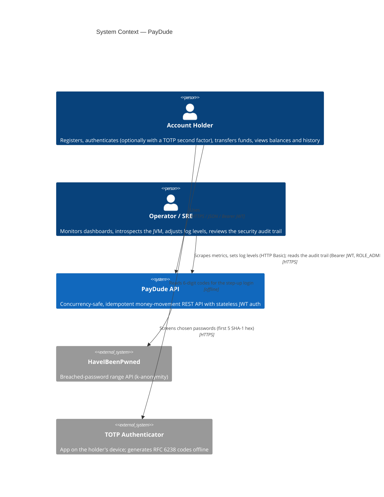
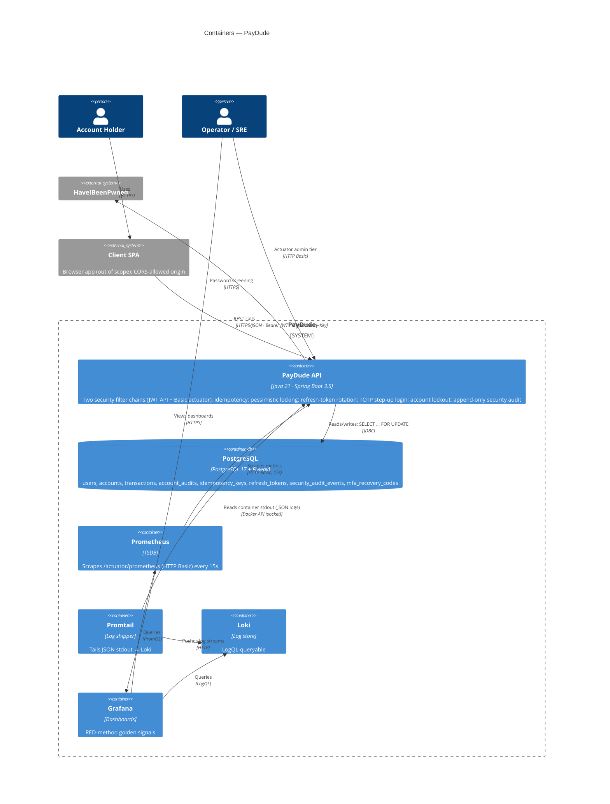
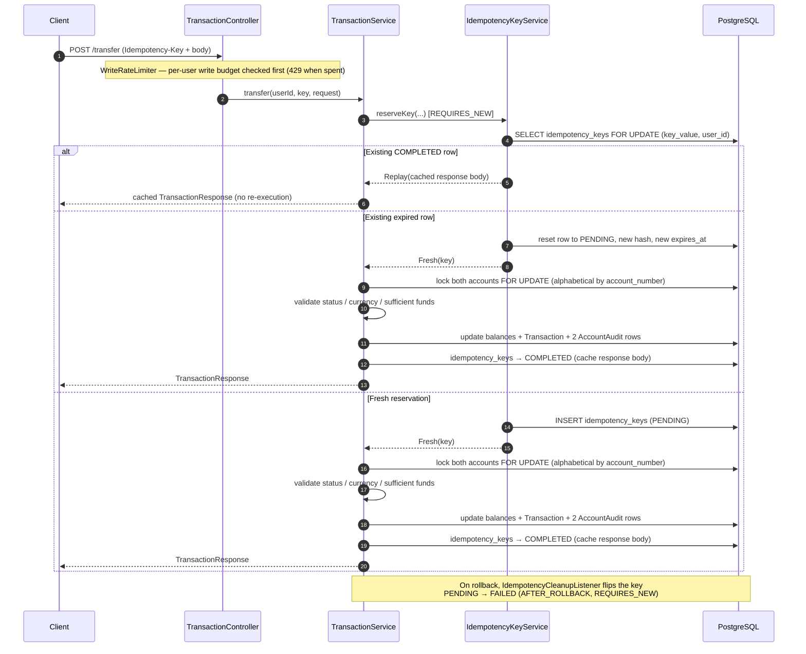
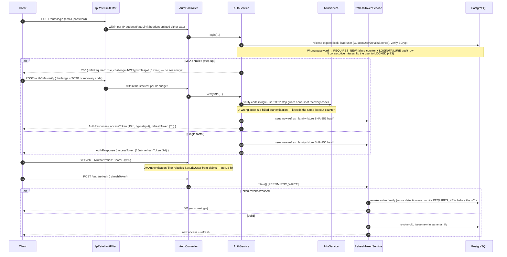
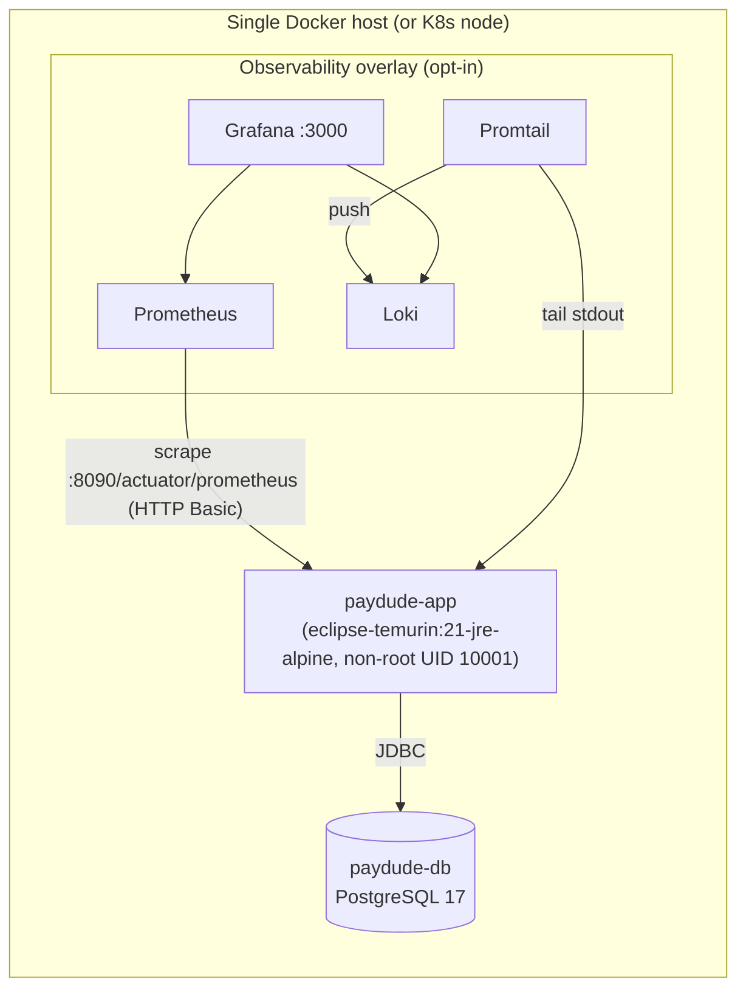

# PayDude — Architecture (arc42)

This document follows the [arc42](https://arc42.org) template: a fixed table of contents for
software-architecture documentation. The diagrams use the [C4 model](https://c4model.com) (Context →
Container → Component → Dynamic) and are embedded below as **Mermaid** (so they render directly on
GitHub). The canonical, higher-fidelity **C4-PlantUML** sources live in [`c4/`](c4/) — see
[`c4/README.md`](c4/README.md) for how to render them.

> Where a topic already has a dedicated document, this file links to it rather than duplicating the
> content. The [24 design patterns](patterns.md) act as informal ADRs and are referenced from §9.

---

## 1. Introduction and Goals

PayDude is a financial-transactions REST API built to demonstrate concurrency-safe banking
operations: **idempotent money movements**, **deadlock-free pessimistic locking**, and a
**stateless JWT security** model implementing the full Spring Security `UserDetails` contract.

### Top quality goals

| Priority | Quality | Concrete meaning |
|----------|---------|------------------|
| 1 | **Correctness / consistency** | No money is created or destroyed: transfers are atomic, balances never go negative, duplicate requests never double-apply. |
| 2 | **Security** | Stateless auth with short-lived access tokens + rotating refresh tokens, opt-in TOTP second factor, breach-screened passwords, layered rate limiting, OWASP/RFC-aligned HTTP hardening. |
| 3 | **Observability** | Every money movement and auth event is measurable (Micrometer) and traceable (W3C Trace Context in every log line). |
| 4 | **Maintainability / clarity** | Clean layering, documented decisions, well-structured tests. |

### Stakeholders

| Stakeholder | Interest |
|-------------|----------|
| Developer (author) | Extend the system without regressions; demonstrate patterns. |
| Operators / SRE (hypothetical) | Run, monitor, and introspect the service safely. |

---

## 2. Constraints

| Constraint | Detail |
|------------|--------|
| Language / runtime | Java 21 (uses virtual threads for request handling). |
| Framework | Spring Boot 3.5.x, Spring Security 6. |
| Persistence | PostgreSQL + Flyway migrations; `spring.jpa.open-in-view=false`. |
| Auth crypto | HMAC-signed JWT (jjwt), BCrypt password hashing; TOTP per RFC 6238 implemented on JCA `HmacSHA1` (no OTP library). |
| Scope | Single-instance deployment — see [§11 Risks](#11-risks-and-technical-debt). |
| Money representation | `NUMERIC(19,4)` only — never floating point. |
| Currencies | `USD`, `MXN`; **no FX conversion** (cross-currency transfers rejected). |
| Server | Listens on port **8090**; profiles `dev` / `prod` / `test`. |

Full standards inventory: [`standards.md`](standards.md).

---

## 3. Context and Scope

PayDude exposes a JSON REST API consumed by a browser SPA (out of scope), screens passwords against
**HaveIBeenPwned**, and is observed by operators. MFA-enrolled holders read TOTP codes from an
**authenticator app** on their device — provisioned once at enrollment, then fully offline (the
second factor adds no runtime dependency). The actuator admin tier (metrics, loggers, env, and the
Prometheus scrape) is reached over **HTTP Basic**; the business API uses **Bearer JWT** — including
the admin-only security-audit read (`GET /v1/admin/audit-events`).

Canonical source: [`c4/context.puml`](c4/context.puml).

---

## 4. Solution Strategy

| Goal (from §1) | Strategy |
|----------------|----------|
| Correctness | Pessimistic row locks acquired in a **fixed alphabetical order** (deadlock-free); **lookup-under-lock idempotency** with a SHA-256 fingerprint of the canonical request; event-driven rollback cleanup. |
| Security | Hybrid token model — stateless access JWT (no DB hit on the hot path) + opaque, rotating, family-revocable refresh tokens; breach screening; layered rate limiting + temporary account lockout (prevention) and an append-only security audit trail (detection); opt-in TOTP step-up login; two-tier + two-chain Spring Security setup. |
| Observability | Micrometer facade → Prometheus; W3C Trace Context in the SLF4J MDC; profile-aware logging (human-readable dev / JSON prod); opt-in Grafana stack. |
| Maintainability | Interface/impl separation, immutable record DTOs, MapStruct mappers, per-concern exception advices, typed `@ConfigurationProperties`. |

---

## 5. Building Block View

### Level 1 — Containers

Canonical source: [`c4/container.puml`](c4/container.puml).

### Level 2 — Components (inside the PayDude API container)

```mermaid
C4Component
title Components — PayDude API container
ContainerDb(db, "PostgreSQL", "JPA + Flyway")
System_Ext(hibp, "HaveIBeenPwned", "Range API")
Container_Boundary(api, "PayDude API") {
  Component(rate, "IpRateLimitFilter", "Servlet filter", "Per-IP token buckets on the public auth POSTs; IETF RateLimit headers; runs before Spring Security")
  Component(jwtchain, "API SecurityFilterChain", "Spring Security @Order(2)", "JwtAuthenticationFilter rebuilds SecurityUser from claims (typ=at+jwt, no DB hit); /v1/admin/** needs ROLE_ADMIN")
  Component(actchain, "Actuator SecurityFilterChain", "Spring Security @Order(1)", "HTTP Basic, ROLE_ADMIN, dedicated in-memory scraper account")
  Component(ctrls, "Controllers", "Spring MVC", "Auth · Account · Transaction · User (v1 + v2) · Mfa · AdminAudit")
  Component(limiters, "Business rate limiters", "bucket4j over Caffeine", "AuthRateLimiter (per email) · WriteRateLimiter (per user) · ReauthRateLimiter (per user)")
  Component(svc, "Domain services", "@Service (iface + impl)", "Auth · Account · Transaction · User business logic + tx boundaries; step-up login orchestration")
  Component(idem, "IdempotencyKeyService", "@Service (REQUIRES_NEW)", "Lookup-under-lock reservation; canonical-JSON SHA-256 hashing")
  Component(refresh, "RefreshTokenService", "@Service", "Opaque token rotation, reuse detection, family revocation")
  Component(mfa, "MfaService + TotpService", "@Service · RFC 6238", "Enrollment lifecycle; single-use TOTP verification + recovery codes")
  Component(lockout, "LoginAttemptService", "@Service (REQUIRES_NEW)", "Persistent lockout counters; LOCKED with auto-expiring window")
  Component(audit, "SecurityAuditService", "@Service (fail-safe + REQUIRES_NEW writer)", "Append-only security_audit_events; also fed by the lockout and MFA flows")
  Component(guard, "BreachedPasswordGuard", "Component", "Fail-open HaveIBeenPwned screening")
  Component(listeners, "Event listeners", "Spring events", "AccountEventListener (BEFORE_COMMIT) · IdempotencyCleanupListener (AFTER_ROLLBACK)")
  Component(cleanup, "ExpiredDataCleanupJob", "@Scheduled 03:00 UTC", "Purges expired idempotency/refresh rows + audit rows past retention")
  Component(metrics, "BusinessMetrics", "Micrometer facade", "Counters + timer published at /actuator/prometheus")
  Component(repos, "Repositories", "Spring Data JPA", "Pessimistic-lock queries (…ForUpdate); atomic UPDATE guards")
}
Rel(rate, jwtchain, "passes allowed requests to")
Rel(jwtchain, ctrls, "authenticated request")
Rel(ctrls, limiters, "budget check before any work")
Rel(ctrls, svc, "delegates")
Rel(ctrls, mfa, "enrollment (password-gated)")
Rel(svc, idem, "reserve key (transfer/deposit/withdraw)")
Rel(svc, refresh, "rotate / revoke")
Rel(svc, mfa, "verify TOTP / recovery proof")
Rel(svc, lockout, "count failures / release locks")
Rel(svc, audit, "append security events")
Rel(refresh, audit, "TOKEN_REUSE_DETECTED / LOGOUT")
Rel(svc, guard, "screen password")
Rel(guard, hibp, "range query", "HTTPS")
Rel(svc, listeners, "publishes events")
Rel(svc, repos, "reads/writes via")
Rel(repos, db, "JDBC")
Rel(svc, metrics, "records signals")
Rel(cleanup, idem, "purge expired")
Rel(cleanup, refresh, "purge expired")
Rel(cleanup, audit, "purge past retention")
Rel(actchain, metrics, "exposes /actuator/prometheus")
```

Canonical source: [`c4/component-api.puml`](c4/component-api.puml). Package layout: see the
README [project structure](../README.md#project-structure).

### Data view

The persistent side of the building blocks — ER diagram, schema design decisions, the
concurrency/locking map and each table's lifecycle — is documented in
[`data-model.md`](data-model.md); the Flyway migrations remain the source of truth.

---

## 6. Runtime View

### Idempotent transfer (`POST /v1/transactions/transfer`)

The flagship scenario. Full prose in the README
[transfer flow](../README.md#transfer-flow); the C4 dynamic source is
[`c4/transfer-dynamic.puml`](c4/transfer-dynamic.puml).

### Authentication (`POST /v1/auth/login` → optional MFA step-up → authenticated request → `POST /v1/auth/refresh`)

Details: [patterns #6, #19, #22 and #24](patterns.md).

---

## 7. Deployment View

The repo ships four Compose layouts, from inner-loop to production-hardened (`docker-compose*.yml`):
the dev DB-only loop, a production-shaped run, a hardened overlay, and an optional observability stack.

| Mode | Command | What runs |
|------|---------|-----------|
| Dev DB only | `docker compose -f docker-compose.db-only.yml up -d` | Postgres only; app on local JVM (`./mvnw spring-boot:run -Dspring-boot.run.profiles=dev`) |
| Production-shaped | `docker compose up -d` | Postgres + app (`prod` profile) |
| Production-hardened | `… -f docker-compose.prod.yml up -d` | + cap-drop, read-only rootfs, resource limits, mandatory secrets |
| + Observability | `… -f docker-compose.observability.yml up -d` | + Prometheus, Loki, Promtail, Grafana |

- The image is a multi-stage, layered-JAR build (deps cached separately from app code), running as a
  fixed-UID non-root user with an in-image `HEALTHCHECK` on `/actuator/health/readiness`.
- `server.shutdown=graceful` + readiness flipping to `OUT_OF_SERVICE` on `SIGTERM` give a clean
  rolling-deploy story; the same probe endpoints lift directly into Kubernetes.

---

## 8. Crosscutting Concepts

Each concept has a deeper reference; this is the index.

| Concept | Summary | Reference |
|---------|---------|-----------|
| **Idempotency** | Lookup-under-lock reservation, canonical-JSON SHA-256 hash, three purpose-built `ObjectMapper`s, sealed `IdempotentRequest`, sealed `ReservationOutcome`. | [patterns #2, #3, #21](patterns.md) |
| **Concurrency / locking** | `PESSIMISTIC_WRITE` in alphabetical `account_number` order; virtual-thread request handling. | [pattern #1](patterns.md) |
| **Security — auth** | Stateless access JWT + opaque rotating refresh tokens; full `UserDetails` contract; breach screening; temporary anti-bruteforce account lockout; append-only, admin-readable security audit log; opt-in TOTP second factor with a step-up login. | [patterns #5, #6, #19, #20, #22, #23, #24](patterns.md) |
| **Security — chains & HTTP** | Two `SecurityFilterChain`s: actuator (HTTP Basic, `@Order(1)`) + API (JWT, `@Order(2)`); CORS, RFC 6750/7617 challenges, OWASP headers, RFC 9111 cache. | [`standards.md`](standards.md), `SecurityConfig` |
| **Rate limiting** | Infra auth tier (`IpRateLimitFilter`, per-IP), login business tier (`AuthRateLimiter`, per-email), authenticated write tier (`WriteRateLimiter`, per-user), and account-security re-auth tier (`ReauthRateLimiter`, per-user — change-password / MFA setup-confirm-disable); IETF `RateLimit` headers advertised proactively on the public token endpoints. | [pattern #18](patterns.md) |
| **Error handling** | RFC 9457 `ProblemDetail`; six per-concern advices with explicit `@Order`. | [patterns #9, #15](patterns.md) |
| **Configuration** | Typed `@ConfigurationProperties` records; no `@Value` in new code; fail-fast at boot. | [pattern #11](patterns.md) |
| **Observability** | `BusinessMetrics` Micrometer facade; W3C Trace Context in MDC; profile-aware logging; Grafana stack. | [patterns #12–#17](patterns.md) |
| **Auditing** | One immutable `AccountAudit` row per balance change (two per transfer); append-only `security_audit_events` for the security trail. | [README domain model](../README.md#domain-model), [pattern #23](patterns.md) |
| **Data lifecycle** | `ExpiredDataCleanupJob` (cron, default 03:00 UTC): bulk-purges expired idempotency keys and refresh tokens, plus audit rows past their retention window. | [`data-model.md` §4](data-model.md#4-data-lifecycle-and-retention) |

---

## 9. Architecture Decisions

This project records decisions as the
[**24 design patterns**](patterns.md) — each is effectively an ADR
(context → decision → rationale → trade-offs). The most consequential:

| # | Decision | Why (1-line) |
|---|----------|--------------|
| 1 | Lock accounts in alphabetical `account_number` order | Serialises A→B vs B→A transfers instead of deadlocking. |
| 2 | Lookup-under-lock idempotency (`PESSIMISTIC_WRITE`, reclaim on expiry) | Race-safe via the row lock and Postgres-safe — insert-first aborts the transaction on a UNIQUE violation, breaking the recovery query. |
| 5/6 | Stateless JWT, rebuilt from claims per request | Zero DB hits on the hot path; only login touches the DB. |
| 15 | RFC 9457 `ProblemDetail` (no bespoke error DTO) | One standard error shape across the whole API. |
| 19 | Opaque, rotating, family-revocable refresh tokens | Shrinks stolen-token blast radius from "until expiry" to "until next refresh". |
| 21 | Sealed `ReservationOutcome` instead of raw status enum | Exhaustive call-sites; the dead `FAILED` branch disappears at compile time. |
| 22 | Temporary, auto-expiring account lockout completing the `LOCKED` state | Anti-bruteforce without the self-DoS of permanent lockout; the IT surfaced and fixed a latent read-only-login bug. |
| 23 | Append-only security audit log, written `REQUIRES_NEW` + fail-safe | A FAILED login's audit row survives the auth transaction's rollback; an audit-write outage never breaks login. |
| 24 | **TOTP second factor** implemented from RFC 6238, with a typed challenge JWT (`at+jwt`/`mfa+jwt`) for the step-up login | MFA whose brute-force story reuses the existing layers: wrong codes feed the lockout, the verify endpoint gets the strictest IP bucket, and codes are single-use per RFC 6238 §5.2. |
| — | **Two security filter chains** (actuator Basic + API JWT) | Confines HTTP Basic to actuator so the API surface stays JWT-only; `/actuator/prometheus` is admin-gated, scraped with a dedicated technical account. |

Rationale for the chain split lives in `SecurityConfig` and
[`standards.md`](standards.md) (RFC 7617).

---

## 10. Quality Requirements

Quality scenarios that pin the goals in §1:

| Quality | Scenario | Where it's verified |
|---------|----------|---------------------|
| Consistency | Two concurrent transfers between the same pair of accounts never deadlock and never corrupt balances. | `VirtualThreadTransferConcurrencyIT` |
| Consistency | A duplicate request under the same `Idempotency-Key` returns the cached response and never re-applies. | `IdempotencyKeyServiceTest`, transfer ITs |
| Security | A reused/revoked refresh token revokes the whole family and forces re-login. | `RefreshTokenReuseDetectionIT`, `RefreshTokenServiceTest` |
| Security | An account locks after N consecutive failed logins (423) and auto-unlocks once the cooldown elapses. | `AccountLockoutIT`, `LoginAttemptServiceImplTest` |
| Security | The MFA journey holds end-to-end: enrollment arms TOTP, login yields a challenge, the code buys tokens; codes are single-use, the challenge JWT is never a Bearer credential, and wrong codes feed the same lockout as wrong passwords. | `MfaLoginIT`, `TotpServiceTest` (RFC 6238 Appendix B vectors) |
| Security | Auth outcomes (failed login, lockout, token reuse, MFA lifecycle) land in the audit trail even when the surrounding transaction rolls back; only `ROLE_ADMIN` can read it. | `SecurityAuditIT` |
| Security | Multi-tenant isolation: a user sees only their own accounts/history and cannot transfer from another user's account. | `AuthorizationIT` |
| Security | The actuator admin tier (incl. Prometheus scrape) rejects anonymous access with a Basic challenge; the API stays JWT-only. | `HttpStandardsIT` |
| Security | 401s carry the correct `WWW-Authenticate` challenge (bare `Bearer` vs `invalid_token`); OWASP headers present. | `HttpStandardsIT` |
| Observability | Pre-registered meters appear at `/actuator/metrics` on cold start before the first increment. | `BusinessMetricsTest` |
| Maintainability | ≥ 60% line coverage (merged unit + integration), enforced at build time. | JaCoCo `check` goal |

---

## 11. Risks and Technical Debt

Scoped-out items, called out honestly (see also README
[known limitations](../README.md#known-limitations)):

| Item | Risk | Mitigation / status |
|------|------|---------------------|
| **Single instance** | Rate-limit buckets and refresh state assume one process; horizontal scaling needs shared storage. | Swap Caffeine buckets for `bucket4j-redis` `ProxyManager`; API unchanged. |
| **Edge volumetric controls** | In-app authenticated limits (money-moving writes and password re-auth) are keyed by user id; coarse per-IP flood protection for every route is outside this process. | Front with nginx/Caddy/Traefik, WAF, cloud LB or API gateway rate limits. |
| **No FX** | Cross-currency transfers are rejected, not converted. | By design for now. |
| **TLS termination** | Not handled in-app. | Front with nginx/Caddy/Traefik or a cloud LB. |
| **Secrets** | Read from env vars; no external secret manager wired. | Acceptable single-host; integrate Vault/SOPS/Secrets Manager for multi-host. |
| **`mfa_secret` at rest** | TOTP secrets are stored plaintext-Base32 — verification must recompute the HMAC from the shared secret, so hashing is impossible. | Documented production step: envelope-encrypt via a KMS; meanwhile rely on DB/volume encryption. |
| **JWT revocation latency** | `SUSPENDED`/`LOCKED` take effect on next token issuance (stateless trade-off). | Time-based expirations are immediate; refresh path enforces state. |

---

## 12. Glossary

| Term | Meaning |
|------|---------|
| **Idempotency key** | Client-supplied UUID; a given key + operation scope yields exactly one effect. |
| **Family (refresh token)** | UUID shared across a rotation chain; revoked as a unit on reuse/logout/password change. |
| **Reuse detection** | Presenting an already-revoked refresh token ⇒ the whole family is revoked (assumed compromise). |
| **Trust tier (actuator)** | Public (`health`/`info`, anonymous) vs admin (everything else, HTTP Basic + `ROLE_ADMIN`). |
| **Canonical JSON** | Field-sorted, `BigDecimal`-normalised request serialization used for the idempotency fingerprint. |
| **RED method** | Rate, Errors, Duration — the golden-signals dashboard layout. |
| **k-anonymity** | HaveIBeenPwned scheme: only the first 5 hex of the password SHA-1 leaves the JVM. |
| **Scraper account** | Dedicated technical (non-domain) user that authenticates the Prometheus scrape over HTTP Basic. |
| **Step-up login** | For an MFA-enrolled account a correct password yields a 5-minute challenge JWT (`typ: mfa+jwt`), not a session; `/v1/auth/mfa/verify` redeems challenge + code for the token pair. |
| **Recovery code** | One of 10 single-use codes issued at MFA confirm (stored SHA-256-hashed, shown once); redeemable in place of a TOTP when the authenticator is lost. |
| **Lockout window** | After N consecutive failed logins (wrong passwords or wrong MFA codes) the account is `LOCKED` until `lockout_expires_at`; a null expiry is a permanent administrative lock. |

---

*Further reading:* [`../README.md`](../README.md) (overview & API) · [`patterns.md`](patterns.md)
(the 24 design decisions) · [`data-model.md`](data-model.md) (ER diagram, schema decisions,
concurrency map, lifecycle) · [`standards.md`](standards.md) (RFC/NIST/ISO/OWASP inventory) ·
[`c4/`](c4/) (C4-PlantUML sources).
