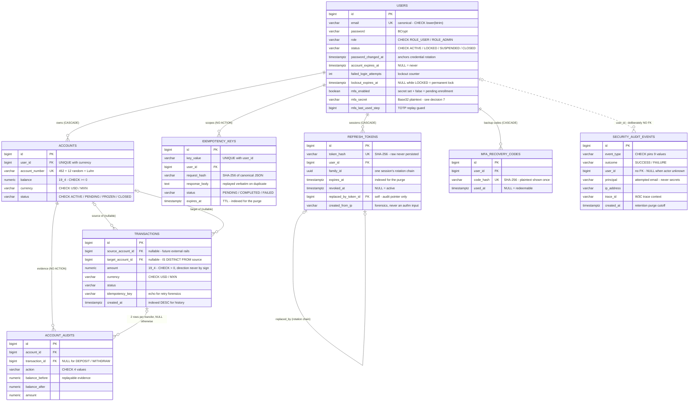

# PayDude — Data Model

The persistent model in one place: the ER diagram, the design decisions behind the schema, the
concurrency map (which write takes which lock), and each table's lifecycle. The **source of truth
is the Flyway migrations** in
[`src/main/resources/db/migration/`](../src/main/resources/db/migration/) — each opens with a
header documenting the rationale of what it creates, and applied migrations are append-only. This
document is the curated map over them; it deliberately does **not** duplicate column-by-column
reference.

---

## 1. ER diagram

Foreign-key *deletion semantics are part of the design* and are labelled on the relationships:
`CASCADE` for operational state owned by the user row, `NO ACTION` where history must block hard
deletes, and **no FK at all** where evidence must outlive its subject.

---

## 2. Schema design decisions

| # | Decision | Why |
|---|----------|-----|
| 1 | **Money is `NUMERIC(19,4)`** — never floating point; request DTOs mirror it with `@Digits(integer = 15, fraction = 4)`. | Binary floats cannot represent decimal cents exactly; a ledger that drifts by rounding is corrupt. |
| 2 | **`TIMESTAMPTZ` for every instant** — no naive local timestamps anywhere. | One unambiguous timeline regardless of server/db timezone configuration. |
| 3 | **Enumerations are `VARCHAR` + a named `CHECK`**, not native `ENUM` types. | The vocabulary is pinned in the schema (a bad write fails loudly), while widening it stays an ordinary, reviewable `DROP/ADD CONSTRAINT` migration — see `V0_004` widening the audit event types — instead of an `ALTER TYPE` with its own locking quirks. |
| 4 | **PKs are `BIGINT GENERATED ALWAYS AS IDENTITY`.** | `ALWAYS` makes it an *error* for the application to supply its own ids. |
| 5 | **Every constraint and index is named** (`uc_` / `chk_` / `fk_` / `idx_`). | Violation messages and query plans grep straight back to the migration that created them. |
| 6 | **Canonical email**: `CHECK (email = lower(btrim(email)))` + named `UNIQUE`. | Turns "a code path forgot to canonicalize" (`EmailNormalizer`) into a hard failure instead of a latent duplicate-identity bug; uniqueness holds at the only form where "same email" is meaningful. |
| 7 | **Secrets-at-rest map**: passwords → BCrypt; refresh tokens and recovery codes → SHA-256 hex; `mfa_secret` → plaintext Base32. | A deliberately-slow hash protects *low-entropy* secrets; tokens and recovery codes are high-entropy random values, so a plain digest loses nothing and keeps the lookup O(1) on the unique index. The TOTP secret must be *used* (the HMAC is recomputed from it each verification), so it cannot be hashed — encrypting it is the documented KMS production step ([pattern #24](patterns.md#24-a-totp-second-factor-with-a-step-up-login)). |
| 8 | **Three-tier deletion semantics** (see diagram): `CASCADE` for operational state (`accounts`, `refresh_tokens`, `mfa_recovery_codes`), `NO ACTION` for history (`transactions`, `account_audits`, `idempotency_keys`), **no FK** for the security audit trail. | An account with movements cannot be hard-deleted — and through `accounts`' own CASCADE, neither can its owner: closing is a *status change*, never a `DELETE`. The audit trail must outlive its subject. |
| 9 | **`CHECK`s as the last line of defense**: `balance >= 0`, `amount > 0`, `source IS DISTINCT FROM target`. | The service validates after taking the row lock; the constraints backstop any future code path that forgets to. `IS DISTINCT FROM` (unlike `<>`) stays true when one side is `NULL`. |
| 10 | **Transaction sides are each nullable**, with a `CHECK` requiring at least one. | Room for future external rails (card top-ups, payouts) where only the internal side of a movement exists. |
| 11 | **`UNIQUE (user_id, currency)`** on accounts; **`UNIQUE (key_value, user_id)`** on idempotency keys. | The first makes the register-time default account deterministic and turns a double-provision race into a constraint violation; the second scopes idempotency keys per user (no cross-tenant collisions or probing) and gives the reservation's `SELECT … FOR UPDATE` a single-row target. |
| 12 | **Account numbers are application-generated** ("452" + 12 `SecureRandom` digits + Luhn check digit); the DB enforces only uniqueness. | Format validation lives app-side (`@AccountNumber`); the generator retries on a collision against the `UNIQUE`. |
| 13 | **Append-only tables are an application contract**, not triggers: `account_audits` and `security_audit_events` map every column `updatable = false` and expose no UPDATE path. | Evidence is never edited; the contract is visible in the entity code and pinned by tests rather than hidden in database triggers. |

---

## 3. Concurrency map

Who locks what, and why each money/security write is race-safe. Full rationale:
[patterns #1, #2, #19, #22, #24](patterns.md).

| Write path | Guard | Where | Why it holds |
|------------|-------|-------|--------------|
| Transfer | `PESSIMISTIC_WRITE` on **both** account rows, acquired in alphabetical `account_number` order | `AccountRepository.findByAccountNumberForUpdate` | A→B and B→A serialise instead of deadlocking; balances are validated *after* the locks. |
| Deposit / withdraw | `PESSIMISTIC_WRITE` on the single account row | `AccountRepository.findByUserIdForUpdate` | Same lock as transfers — a concurrent transfer and deposit on one account serialise. |
| Idempotency reservation | SELECT-first under `PESSIMISTIC_WRITE`, in `REQUIRES_NEW` | `IdempotencyKeyRepository.findByKeyValueAndUserIdForUpdate` | Lookup-under-lock: duplicates queue on the row. Insert-first is unsafe on Postgres — a UNIQUE violation aborts the transaction, breaking any recovery query (pinned by `IdempotencyKeyReservationIT`). |
| Refresh rotation | `PESSIMISTIC_WRITE` on the token row (by hash) | `RefreshTokenRepository.findByTokenHashForUpdate` | Racing `/refresh` calls serialise; the loser finds the token already revoked and trips reuse detection — the chain never forks. Family revocation then commits in `REQUIRES_NEW` *before* the 401 is thrown. |
| Lockout counters | Atomic single-statement UPDATEs in `REQUIRES_NEW` | `UserRepository.incrementFailedLoginAttempts` / `lockIfThresholdReached` / `releaseExpiredLock` / `resetFailedLoginAttempts` | No read-modify-write, so concurrent failures cannot lose an increment; the count survives the rejected login's rollback; an unknown email matches 0 rows — no enumeration oracle. |
| TOTP single-use (RFC 6238 §5.2) | Atomic step guard | `UserRepository.markMfaStepUsed` | Zero rows updated = this time step was already redeemed: a replay (or the loser of a concurrent race) is rejected even inside the ±1-step acceptance window. |
| Recovery-code redemption | Atomic consume guarded by `used_at IS NULL` | `MfaRecoveryCodeRepository.consume` | Two concurrent redemptions of the same code cannot both win. |
| MFA confirm | `PESSIMISTIC_WRITE` on the user row | `UserRepository.findByIdForUpdate` | Racing confirms serialise, so exactly one 10-code recovery batch can ever exist. |
| Nightly purges | Bulk `@Modifying` deletes behind the `expires_at` / `created_at` indexes | `deleteByExpiresAtBefore` (×2), `SecurityAuditEventRepository.deleteByCreatedAtBefore` | Single-statement, index-backed cutoff scans; the three deletes run in independent transactions so one failure cannot roll back the others. |

> **Deadlock note**: `MfaServiceImpl.verify` runs `REQUIRES_NEW` so the row lock taken by
> `markMfaStepUsed` is released *before* `recordSuccess` (also `REQUIRES_NEW`, same `users` row)
> runs — joined to the login transaction, the two would self-deadlock.

---

## 4. Data lifecycle and retention

| Table | Written by | Growth bound | On user hard-delete |
|-------|-----------|--------------|---------------------|
| `users` | Registration | Permanent (`CLOSED` is a status, not a `DELETE`) | — |
| `accounts` | `AccountEventListener` (BEFORE_COMMIT on register) | Permanent | `CASCADE` — but blocked anyway once movements exist (the `transactions` FKs are `NO ACTION`) |
| `transactions` | Transfers | Permanent financial history | Blocks the delete |
| `account_audits` | Every balance change (two rows per transfer) | Permanent evidence | Blocks the delete |
| `idempotency_keys` | Money-moving POSTs | TTL `application.idempotency.key-ttl` (default **24d**): expired rows are reclaimed in place on key reuse and bulk-purged nightly | Blocks while rows live (`NO ACTION`); purge unblocks |
| `refresh_tokens` | Login / register / refresh | Expiry 7d (`PT168H`); **revoked-but-unexpired rows are kept on purpose** — they are the evidence reuse detection needs — and only expired rows are purged nightly | `CASCADE` (session plumbing, not evidence) |
| `mfa_recovery_codes` | MFA confirm (batch of 10) | Replaced wholesale on re-enrollment, deleted on disable; consumed rows keep their `used_at` until then | `CASCADE` |
| `security_audit_events` | Auth flows (login, logout, register, password change, lockout, token reuse, MFA lifecycle) | Retention `application.security.audit.retention` (default **365d**), purged nightly | **Survives** — no FK by design |

The nightly purge is `ExpiredDataCleanupJob` (cron `application.cleanup.cron`, default 03:00 UTC;
disabled in the `test` profile). Note the consequence of decision 8: **there is no user-deletion
API, and the FK graph makes hard-deleting any user with financial history impossible by
construction** — a right-to-erasure requirement would be implemented as an anonymization
migration over `users`, never as a `DELETE`.

---

## 5. Source of truth

| Migration | Creates |
|-----------|---------|
| [`V0_001__init_schema.sql`](../src/main/resources/db/migration/V0_001__init_schema.sql) | `users` (incl. lockout columns), `accounts`, `transactions`, `account_audits`, `idempotency_keys` + all baseline conventions |
| [`V0_002__create_refresh_tokens.sql`](../src/main/resources/db/migration/V0_002__create_refresh_tokens.sql) | `refresh_tokens` (rotation, families, reuse detection) |
| [`V0_003__create_security_audit_events.sql`](../src/main/resources/db/migration/V0_003__create_security_audit_events.sql) | `security_audit_events` (append-only detection trail) |
| [`V0_004__add_totp_mfa.sql`](../src/main/resources/db/migration/V0_004__add_totp_mfa.sql) | `users` MFA columns, `mfa_recovery_codes`, audit vocabulary widening |

New migrations follow `V0_00X__<verb>_<change>.sql`, open with a rationale header, and are
**append-only** — never edit one that has run against a shared database. If a generated
column-by-column reference is ever wanted, point [SchemaSpy](https://schemaspy.org/) or
[`tbls`](https://github.com/k1LoW/tbls) at a migrated database; this document stays the curated
layer on top.

---

*Related:* [`architecture.md` §5](architecture.md#5-building-block-view) (building blocks) ·
[`patterns.md`](patterns.md) (#1 locking, #2/#3/#21 idempotency, #19 refresh tokens, #22 lockout,
#23 audit trail, #24 MFA) · [README → Domain model](../README.md#domain-model) (condensed view).
